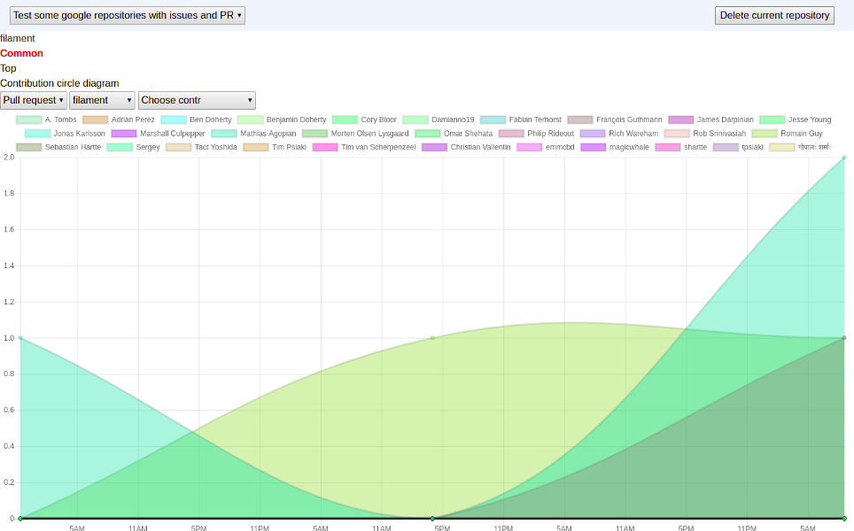

### Examples of tracking repository statistics:

*Statistics of commits frequency by repository*

*Statistics of pull requests frequency by repository*

*Statistics of issues frequency by repository*

*Statistics of contributors by repository presented in bar chart*

*Statistics of contributors by repository presented in pie chart*

### Examples of tracking contributor statistics:

*Statistics of commits frequency by contributor*

*Statistics of pull requests frequency by contributor*

*Statistics of issues frequency by contributor*
