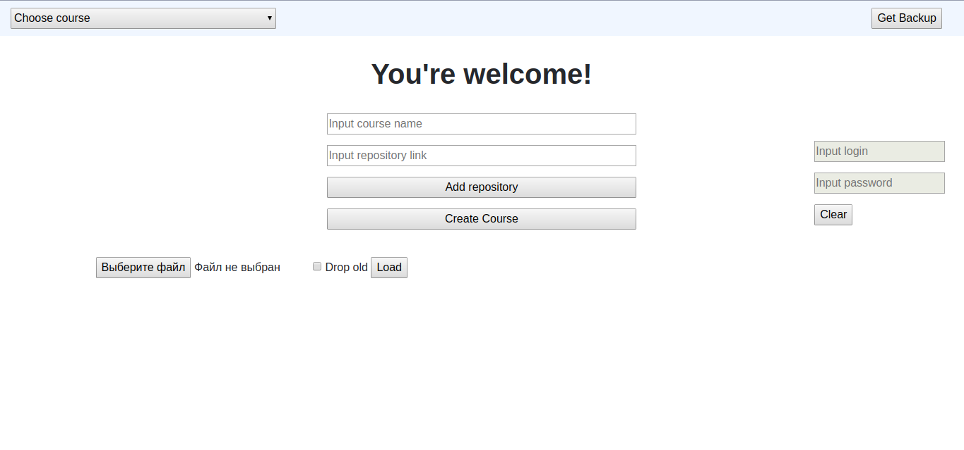
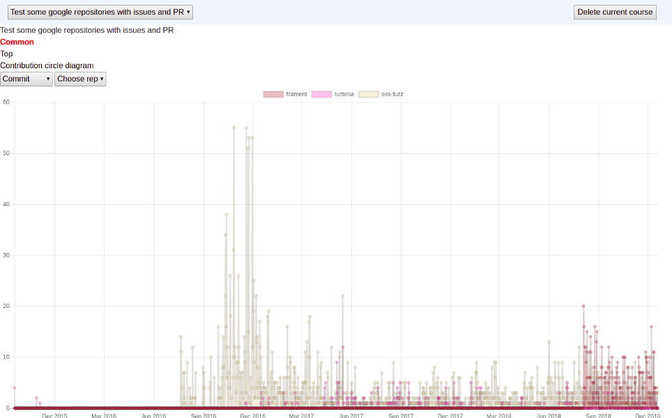
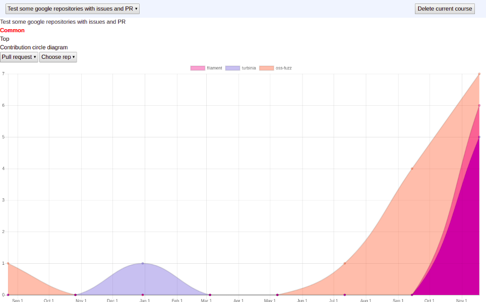
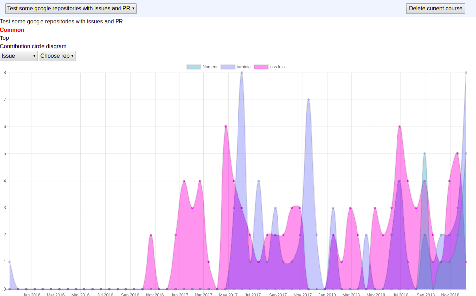
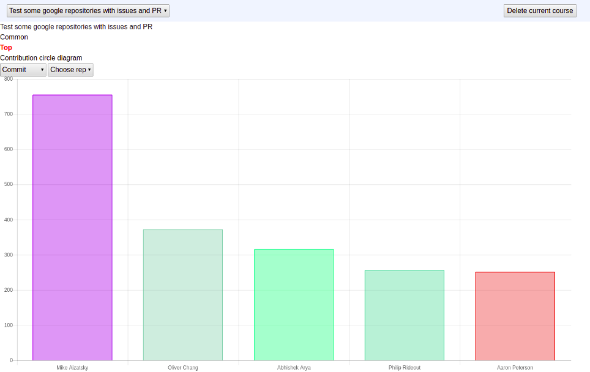
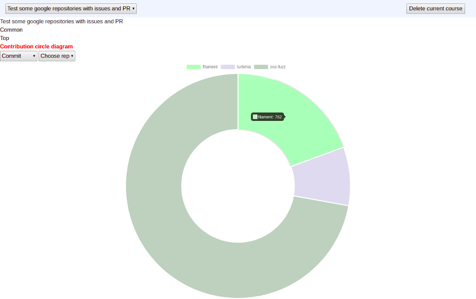

# nosql2018-github_stats
---

## Web application to track GitHub repositories activity.  

You can track some statistics by course (a set of repositories), by repository and by contributor.

### Usage examples:

*Statistics of commits frequncy by course*

*Statistics of pull requests frequncy by course*

*Statistics of issues frequncy by course*

*Statistics of contributors by course presented in bar chart*

*Statistics of contributors by course presented in pie chart*

